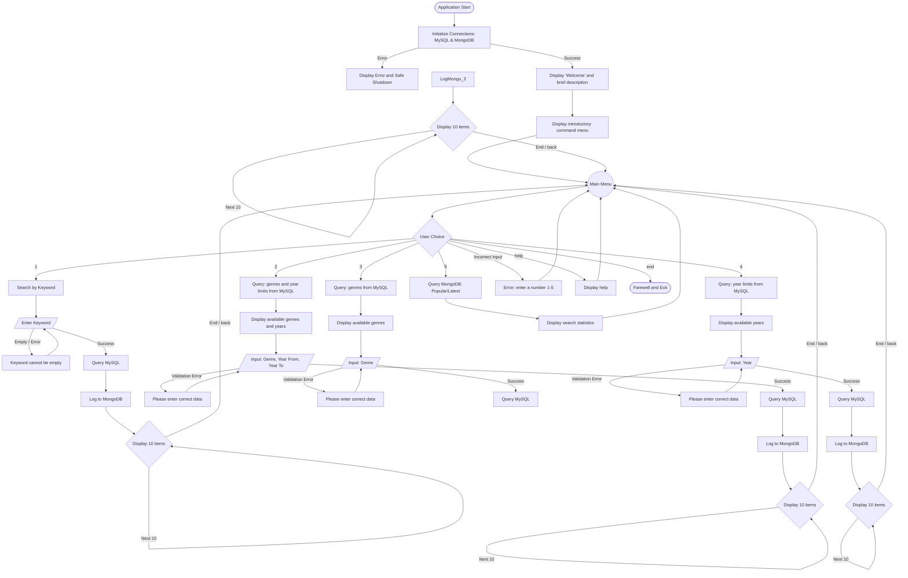

# Architecture and Logic of the "MovieSearch" Console Application

**Name:** MovieSearch
**Format:** Console application, designed to run on any OS (Windows/macOS/Linux).
**Goal:** To provide users with a friendly and interactive console application for searching movies in the Sakila database.

## Technology Stack
*   **Python 3.x** — The main programming language.
*   **MySQL** — Relational database for storing movie information (Sakila database).
*   **MongoDB** — NoSQL database for storing search query logs and statistics.
*   **`mysql-connector-python`** — Library for connecting to MySQL.
*   **`pymongo`** — Library for connecting to MongoDB.
*   **`uuid`** — Library for generating unique identifiers (Persistent ID).
*   **`mermaid`** — Used for generating diagrams.

## 1. Project Structure (Modules)
The project is organized into logical modules following the Single Responsibility Principle to avoid code duplication:

*   **`main.py`** — The application's starting point. It handles startup, setup, the main user interaction loop (menu), command routing, and processing global commands (`end`, `back`, `help`).
*   **`mysql_connector.py`** — Data Access Layer (DAO) for MySQL. Contains functions for:
    *   Getting a list of all genres.
    *   Getting the minimum and maximum release years.
    *   Searching for movies by title (using `LIMIT` and `OFFSET`).
    *   Searching for movies by genre and year range (using `LIMIT` and `OFFSET`).
    *   Searching for movies by genre (using `LIMIT` and `OFFSET`).
    *   Searching for movies by year (using `LIMIT` and `OFFSET`).
*   **`log_writer.py`** — Data writing layer for MongoDB. It takes search parameters and the number of found results, creates a document, and saves it to a collection.
*   **`log_stats.py`** — Data analytics layer for MongoDB. It retrieves the top 5 popular queries and a list of the user's latest queries.
*   **`formatter.py`** — Visual display module (View). Contains functions for formatted output to the console (movie tables, genre lists, welcome message, farewell message, main menu, and help menu).

## 2. Global Interface Rules
To ensure a "User Friendly" experience throughout the application, the following global commands are always active:
*   **`end`** — Stops the current action, closes database connections, shows a nice farewell message, and exits the program. - Always available.
*   **`back`** — Cancels the current input and returns to the main menu.
*   **`help`** — Displays help (a list of available actions). - Always available.

## 3. Application Flow Diagram and Validation
### 3.1. User Input Processing Rules (Universal Handler)
To prevent the program from crashing due to incorrect data input, a unified input validation system is used for all menus:

*   **Case-insensitivity and spaces**: Any user input is automatically cleaned of extra spaces at the beginning and end, and converted to lowercase (using `.strip().lower()`). Commands like END, End, end will be recognized correctly.
*   **Empty input**: If the user presses Enter without typing anything (or only spaces), a warning is shown: "Error: Input cannot be empty. Please try again."
*   **Incorrect data type**: When expecting a menu number (1, 2, 3, 4, 5), entering letters, special characters, or text in another language is handled by a `try...except` block or `if in [...]`. A message is displayed: "Error: Invalid input. Please enter a number from the provided menu."
*   **Incorrect filter data**: When entering years, the system checks if they are numbers (`isdigit()`) and if "Year From" is less than or equal to "Year To". If there's an error, the user is asked to re-enter the data without returning to the main menu.



## 4. Key Function Algorithms

### 4.1. Search Results Pagination
To avoid overwhelming the console, results are returned in parts:
1.  An SQL query is run with `LIMIT 10 OFFSET 0`.
2.  If 10 results are returned, the user is asked: "Show next 10 results? (Enter - yes / back - to menu / end - exit)".
3.  If confirmed, `OFFSET` is increased by 10, and the query is repeated.
4.  This process continues until the database returns fewer than 10 records, which means the end of the list.

### 4.2. Query Logging
Every time a user starts a search and MySQL returns a result (even an empty one), the `log_writer.py` logging function is called.
A JSON document with the following format is created:
```json
{
  "timestamp": "2025-05-01T15:34:00",
  "user_id": "unique_persistent_id_here", 
  "search_type": "keyword", 
  "params": {
    "keyword": "matrix"
  },
  "results_count": 3
}
```
*   **`user_id`**: A unique user identifier (Persistent ID), generated when the application first starts and saved locally (for example, in a `user_id.txt` file). This allows tracking the actions of the same user across different sessions, which is very important for accurate analytics. Without it, every search from the same user would look like a new user, distorting the statistics.
*   In the case of searching by genre and years, the `search_type` field will be `genre_year`, and `params` will contain `genre_id`, `min_year`, `max_year`.*

### 4.3. Error Handling
*   Loss of connection to MySQL/MongoDB should be caught by a `try...except` block. The application should report "Problem with database connection" and not "crash" with a long Python Traceback.
*   Invalid input (letters instead of numbers when entering a year, selecting a non-existent menu item) is caught with a request to repeat the input.